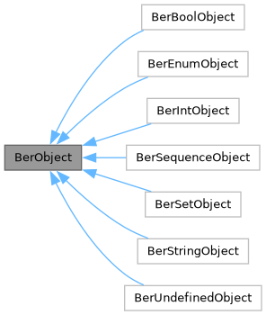
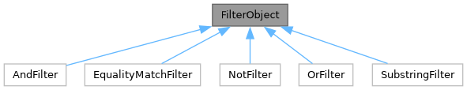

# Teorie

## LDAP

LDAP (Lightweight Directory Access Protocol) je mechanismus pro interakci s adresářovými servery. Je často využíván k autentizaci a ukládání informací o uživatelích, skupinách a aplikacích. LDAP server se dá ale využít i pro ukládání jiných informací. [1]

Adresáře jsou ve stromových strukturách. Každá položka v adresáři má vlastní atributy, ke kterým lze přistupovat. [1]

## BER ANS.1

LDAP používá pro komunikaci TLV kódování BER. Základní princip tohoto kódování je že každý datový typ se skládá ze tří částí. Tag, délka a data. Tag určuje typ dat, délka určuje délku dat a data jsou samotná data.
BER obsahuje spoustu základních typů (int, boolean, sequence, enum, atd...) a také je ho možné rozšířit o typy specifické pro vlastní aplikaci.
[2]

## Komunikace

Veškeré zprávy jsou zabalené v tzv. obálce, která obsahuje MessageID. Toto MessageID slouží k identifikaci, na kterou zprávu server odpovídá, a veškeré zprávy serveru obsahují stejné MessageID jako zpráva, na kterou odpovídají. [4]

Komunikace probíhá většinou pomocí TCP protokolu, ale je možné použít i UDP.

### LDAP princip vyhledávání

Při vyhledávání, je klientem serveru zaslán dotaz. Tento dotaz obsahuje filter, doménu, volitelně přihlašovací údaje a další parametry.
Server následně tento dotaz zpracuje a vrací jednotlivé položky co odpovídají dotazu. Odpověď dokončí odpovědí SearchResultDone, s kódem 0, který značí úspěšné dokončení vyhledávání, případně s jiným kódem, který značí chybu.  [4]

### LDAP princip přihlášení

Kdykoli během komunikace může klient požádat o přihlášení. Přihlášení probíhá pomocí BIND_REQUEST, který obsahuje typ přihlášení a přihlašovací údaje. Server následně zpracuje tento požadavek a vrátí odpověď BIND_RESPONSE, která obsahuje kód, který značí úspěšné přihlášení, nebo chybu.  [4]

## Filtry

V LDAP existují různé druhy filtrů, které se dají kombinovat a pomoci nich vyhledávat položky. Mezi filtry implementované v této aplikaci patří: Equality Match, Substrings, AND, OR, NOT. [4][3]

Příklady filtrů:

- Equality Match: (uid=xvesel38) - vyhledává uživatele s uid xvesel38
- Substrings: (uid=\*vesel\*) - vyhledává uživatele jejichž uid obsahuje vesel
- AND: (&(uid=xvesel38)(uid=\*vesel\*)) - vyhledává uživatele jejichž uid obsahuje vesel a je rovno xvesel38
- OR: (|(uid=xvesel38)(uid=xvesel40)(uid=xvesel39)) - vyhledává uživatele jejichž uid je xvesel38, xvesel40 nebo xvesel39
- NOT: (!(uid=xvesel38)) - vyhledává uživatele jejichž uid není xvesel38

## CSV

CSV (Comma-separated values) je jednoduchý formát pro ukládání tabulkových dat. Jednotlivé řádky jsou odděleny znakem nového řádku a jednotlivé sloupce jsou odděleny čárkou případně jiným oddělovačem. [5]

## TCP

TCP (Transmission Control Protocol) je spolehlivý protokol pro přenos dat. Zajišťuje, že data dorazí v pořádku a ve správném pořadí. Jedná se o proud dat. [6]

# Použití

./isa-ldapserver {-p \<port\>} -f \<soubor\>


Význam parametrů a jejich hodnot:

-p \<port\>: Umožňuje specifikovat konkrétní port, na kterém začne server naslouchat požadavkům klientů. Výchozí hodnota čísla portu je 389.
-f \<soubor\>: Cesta k textovému soubor ve formátu CSV.

Aplikaci lze ukončit pomocí klávesové zkratky Ctrl+C (SIGINT).

## Sestavení

Sestavení probíhá pomocí příkazu `make`. Výsledkem je spustitelný soubor `isa-ldapserver`. Veškeré zdrojové soubory jsou ve složce src, a hlavičkové soubory ve složce inc.
Příkaz `make clean` smaže obj soubory a binárku.


# Popis funkce aplikace

Hlavní smyčka aplikace je v souboru server.cpp, ve kterém se prvně nastaví poslouchání na uživatelem zadaném portu. Následně aplikace čeká dokud nepřijde požadavek od ldap klienta. Následně dojde k forku, a v dceřiném procesu se zpracuje požadavek klienta.

Na požadavek podproces reaguje dle jeho typu. Podporuje 3 druhy požadavků od klienta. Tyto požadavky jsou:

- BIND_REQUEST
- SEARCH_REQUEST
- UNBIND_REQUEST

## BIND_REQUEST

Bind request může přijít kdykoli a nemusí být prvním požadavkem. Zde se ověřuje jestli client žádá o správný typ přihlášení. Aplikace podporuje pouze simple bind, pokud klient zažádá o jiný způsob přihlášení, je mu vrácena chyba, a komunikace ukončena. Pokud je vše v pořádku, je klientovi vrácen úspěšný BIND_RESPONSE.

## SEARCH_REQUEST

Search request může přijít kdykoli a není třeba aby navazoval na bindrequest. Podproces následně zpracuje tento požadavek, vyhledá v databázi odpovídající záznamy a pomocí odpovědi SearchResultEntry je vrátí klientovi (na každý záznam se odesílá jedna SearchResultEntry).
Nakonec pošle SearchResultDone, kterým oznámí klientovi, že je vyhledávání dokončeno.

## UNBIND_REQUEST

Jakmile příjde tento požadavek, podproces ukončí komunikaci s klientem a ukončí se.

## Ukončení

Při zaslání SIGINT (CTRL + c) začne hlavní proces ukončovat všechny své podprocesy a následně se ukončí.


# Rozšíření oproti zadání

## Výběr atributů

Aplikace podporuje možnost vybrat si jaké atributy chce uživatel vyhledat. V případě, že uživatel nevybere žádný atribut, jsou mu vráceny všechny atributy. Neexistující atributy jsou ignorovány.

## Notice of Disconnection

Pokud dojde k chybě, která nejde oznámit přes odpovídající odpověď na požadavek, je klientovi oznámeno ukončení komunikace pomocí Notice of Disconnection.

## Přihlášení kdykoli

Není třeba se přihlásit před bind requestem, ale je možné se přihlásit kdykoli během komunikace (LDAP3). Jelikož server podporuje jen podporuje jen simple bind, bez autentizace tak to nemá význam. Ale je možné potom velice jednoduše rozšířit aplikaci pro další typy autentizace.

# Zdrojový kód

Program byl psát v jazyku CPP s objektovým přístupem. Zdrojový kód byl dokumentován pomocí Doxygenu. Výsledná dokumentace je k dispozici v adresáři docs v souboru docs/refman.pdf.

Zde je pouze stručný popis zajímavých tříd, jejich významu a použití.

## Popis důležitých souborů

- server.h - obsahuje ldap server
- ldap_comunication.h - obsahuje třídy pro komunikaci s klientem
- DatabaseController.h - obsahuje třídy pro práci s csv databází
- BerObject.h - základní objekt pro BER typy
  - BerXObject.h - objekt pro konkrétní BER typ, dědí z BerObject
- FilterObject.h - základní objekt pro LDAP filtry
  - XFilterObject.h - objekt pro konkrétní LDAP filtr, dědí z FilterObject

Podrobnější popis v souboru docs/refman.pdf.

## Třídy

## BerObject

Je bázovým objektem pro objekty reprezentující BER struktury. Obsahuje základní metody pro ostatní objekty.

Pomocí funkce `getBerRepresentation`  lze získat reprezentaci objektu v podobě BER bajtového pole. Které lze snadno odeslat klientovy.
Pro deserializaci je třeba využít funkce `ParseBerObject` která vrací ukazatel na nově vytvořený objekt.

Z těchto objektů lze snadno vytvářet BER struktury a pracovat s nimy.



## FilterObject

Je bázovým objektem pro objekty reprezentující LDAP filtry. Jeho podtřídy jsou obsahují metody pro snadnou práci s nimy.



## DatabaseController

Třída DatabaseController slouží pro práci s csv databází. Obsahuje metody pro načítání řádků z databáze a vrací je v podobě objektů třídy DatabaseObject.

## DatabaseObject

Třída DatabaseObject slouží pro reprezentaci řádku v databázi. Obsahuje metody pro získání hodnot atributů.

# Testování

## Testovací prostředí

- client
  - program ldapsearch
  - OS Manjaro Linux 23.0.4
- server
  - program isa-ldapserver
  - OS CentOS Linux 7
- databáze uživatelů
  - soubor [ldap-lidi-ascii.csv](http://nes.fit.vutbr.cz/ivesely/ldap-lidi-ascii.csv)
- shell
  - zsh 5.9

## Testovací scénáře

## Vyhledávání

### Vyhledávání všech uživatelů

- příkaz: `ldapsearch -H ldap://merlin.fit.vutbr.cz:10013 -x "(uid=x*)"`

- Wireshark: nehlásil chybu v komunikaci

Výsledek prošel dle očekávání a program vypsal všechny uživatele, jejichž uid začíná na x(kompletní soubor).

### Vyhledávání uživatele pokročilejší filty

- příkaz:

```ldapsearch -H ldap://merlin.fit.vutbr.cz:10013 -x "(&(|(uid=xves*)(cn=*imir))(email=*stud*))"```

- Wireshark: nehlásil chybu v komunikaci

Výsledek prošel dle očekávání a program vypsal všechny uživatele, jejichž uid začíná na xves, nebo cn obsahuje imir a email obsahuje stud.

### forkování procesů

### 10 klientů

- příkaz: pro jednoho client `nc merlin.fit.vutbr.cz 10013`

Výsledek prošel dle očekávání a clienti se mohli připojovat a odpojovat kdykoliv chtěli.

### Ukončení serveru při připojení několika clientů

- příkaz: pro jednoho client `nc merlin.fit.vutbr.cz 10013`

Výsledek prošel dle očekávání a server se ukončil a všechny své podprocesy zabil. Také klientům, kteří byli ještě připojeni odeslal Notice of Disconnection s chybovým kódem unavailable.

### IPV6 a IPV4

Toto testování proběhlo pouze na lokálním stroji(Manjaro), jelikož nemám IPV6 připojení k dispozici.

### IPV6

- příkaz: `ldapsearch -H ldap://\[::1\]:10013 -x "(uid=xvesel38)"`
- Wireshark: nehlásil chybu v komunikaci
Výsledek prošel dle očekávání a program vypsal uživatele s uid xvesel38.

### IPV4

- příkaz: `ldapsearch -H ldap://127.0.0.1:10013 -x "(uid=xvesel38)"`
- Wireshark: nehlásil chybu v komunikaci

Výsledek prošel dle očekávání a program vypsal uživatele s uid xvesel38.


### Různé parametry

### špatné argumenty při spuštění serveru

- příkaz: `./isa-ldapserver -p 10000000 -f ldap-lidi-ascii.csv`
- příkaz: `./isa-ldapserver -p 0 -f ldap-lidi-ascii.csv`
- příkaz: `./isa-ldapserver -p -f ldap-lidi-ascii.csv`
- příkaz: `./isa-ldapserver -f neexistujici_soubor`

Při všech těchto příkazech došlo k ukončení serveru a vypsání chybového výstupu.

### ldapsearch bez -x (bez simple bind)

- příkaz: `ldapsearch -H ldap://merlin.fit.vutbr.cz:10013 "(uid=xvesel38)"`
- Wireshark: nehlásil chybu v komunikaci

Výsledek dle očekávání vrátil `ldap_sasl_interactive_bind: No such object (32)` jelikož tato implementace ldap serveru nepodporuje presence filtry, takže ldapsearch nenašel žádný záznam o použitých technologiích k přihlášení a ukončil komunikaci, bez pokusu o přihlášení.

### size limit

#### size limit 0

- příkaz: `ldapsearch -H ldap://merlin.fit.vutbr.cz:10013 -x "(uid=x*)" -z 0`
- Wireshark: nehlásil chybu v komunikaci

Výsledek dle očekávání vrátil všechny uživatele, jelikož size limit byl nastaven na 0, a tedy deaktivován.

#### size limit 1

- příkaz: `ldapsearch -H ldap://merlin.fit.vutbr.cz:10013 -x "(uid=x*)" -z 1`
- Wireshark: nehlásil chybu v komunikaci

Výsledek dle očekávání vrátil pouze jednoho uživatele, jelikož size limit byl nastaven na 1.

#### size limit 850

- příkaz: `ldapsearch -H ldap://merlin.fit.vutbr.cz:10013 -x "(uid=x*)" -z 850`
- Wireshark: nehlásil chybu v komunikaci

Výsledek dle očekávání vrátil 850 uživatelů, jelikož size limit byl nastaven na 850.

#### size limit 200000

- příkaz: `ldapsearch -H ldap://merlin.fit.vutbr.cz:10013 -x "(uid=x*)" -z 200000`
- Wireshark: nehlásil chybu v komunikaci

Výsledek dle očekávání vrátil všechny uživatele, jelikož size limit byl nastaven na 200000, což je více než je počet uživatelů v databázi.

### Jednotlivé filtry

### Equality Match

- příkaz: `ldapsearch -H ldap://merlin.fit.vutbr.cz:10013 -x "(uid=xvesel38)"`
- příkaz: `ldapsearch -H ldap://merlin.fit.vutbr.cz:10013 -x "(cn=Vesely Vladimir)"`
- příkaz: `ldapsearch -H ldap://merlin.fit.vutbr.cz:10013 -x "(email=xvesel38@stud.fit.vutbr.cz)`

- Wireshark: nehlásil chybu v komunikaci

Výsledek prošel dle očekávání a program vypsal u všech příkazů následující výstup:

```
# extended LDIF
#
# LDAPv3
# base <> (default) with scope subtree
# filter: (uid=xvesel38)
# requesting: ALL
#

#
dn: xvesel38
cn: Vesely Vladimir
email: xvesel38@stud.fit.vutbr.cz
uid: xvesel38

# search result
search: 2
result: 0 Success

# numResponses: 2
# numEntries: 1

```

### Substrings

- příkaz: `ldapsearch -H ldap://merlin.fit.vutbr.cz:10013 -x "(uid=*ve*el*)"`

- Wireshark: nehlásil chybu v komunikaci

Výsledek prošel dle očekávání a program vypsal všechny uživatele, jejichž uid obsahuje `ve` a `el`.

### AND

- příkaz: `ldapsearch -H ldap://merlin.fit.vutbr.cz:10013 -x "(&(uid=xve*)(uid=*sel38))"`

- Wireshark: nehlásil chybu v komunikaci

Výsledek prošel dle očekávání a program vypsal všechny uživatele s uid xvesel38.

```
# extended LDIF
#
# LDAPv3
# base <> (default) with scope subtree
# filter: (&(uid=xve*)(uid=*sel38))
# requesting: ALL
#

#
dn: xvesel38
cn: Vesely Vladimir
email: xvesel38@stud.fit.vutbr.cz
uid: xvesel38

# search result
search: 2
result: 0 Success

# numResponses: 2
# numEntries: 1

```

### OR

- příkaz: ```ldapsearch -H ldap://merlin.fit.vutbr.cz:10013 -x \"(|(uid=xvesel38)(uid=xvesel40))" ```
- Wireshark: nehlásil chybu v komunikaci

Výsledek prošel dle očekávání a program vypsal 3 uživatele s uid xvesel38, xvesel40.

```
# extended LDIF
#
# LDAPv3
# base <> (default) with scope subtree
# filter: (|(uid=xvesel38)(uid=xvesel40)(uid=xvesel39))
# requesting: ALL
#

#
dn: xvesel40
cn: Vesely Ales
email: xvesel40@stud.fit.vutbr.cz
uid: xvesel40

#
dn: xvesel38
cn: Vesely Vladimir
email: xvesel38@stud.fit.vutbr.cz
uid: xvesel38

# search result
search: 2
result: 0 Success

# numResponses: 4
# numEntries: 3
```

### NOT

- příkaz: `ldapsearch -H ldap://merlin.fit.vutbr.cz:10013 -x "(|(!(uid=x*))(uid=xvesel38))"`
- Wireshark: nehlásil chybu v komunikaci

Výsledek prošel dle očekávání a vypsal pouze jednoho uživatele s uid xvesel38.

```
# extended LDIF
#
# LDAPv3
# base <> (default) with scope subtree
# filter: (|(!(uid=x*))(uid=xvesel38))
# requesting: ALL
#

#
dn: xvesel38
cn: Vesely Vladimir
email: xvesel38@stud.fit.vutbr.cz
uid: xvesel38

# search result
search: 2
result: 0 Success

# numResponses: 2
# numEntries: 1

```

### speciální případy

### Vyhledávání podle neexistujícího atributu

- příkaz: `ldapsearch -H ldap://merlin.fit.vutbr.cz:10013 -x "(uidd=xvesel38)"`
- WireShark: nehlásil chybu v komunikaci

Výsledek dle očekávání neobsahoval žádné záznamy.

### Negace vyhledávání podle neexistujícího atributu

- příkaz: `ldapsearch -H ldap://merlin.fit.vutbr.cz:10013 -x "(!(uidd=xvesel38))"`
- WireShark: nehlásil chybu v komunikaci

Výsledek dle očekávání neobsahoval žádné záznamy.

### Dlouhý filtr

- příkaz: ```ldapsearch -H ldap://merlin.fit.vutbr.cz:10013 -x "(|(uid=xvesel38)(uid=xvesel40))"```
  - pozn: (uid=xvesel38)(uid=xvesel40) se 100 x opakovalo

- WireShark: nehlásil chybu v komunikaci

Výsledek dle očekávání vypsal uživatele s uid xvesel38, xvesel40, xvesel39.

### Dlouhý Equality Match

- příkaz: ```ldapsearch -H ldap://merlin.fit.vutbr.cz:10013 -x "(!(uid=dlouhyretezec))"```
  - pozn: `dlouhyretezec` byl 1000 x znak `a`
- WireShark: nehlásil chybu v komunikaci

Výsledek dle očekávání obsahoval všechny uživatele.

### Dlouhý Substrings

- příkaz: ```ldapsearch -H ldap://merlin.fit.vutbr.cz:10013 -x "(!(uid=*dlouhyretezec))"```
  - pozn: `dlouhyretezec` byl 1000 x znak `a`
- WireShark: nehlásil chybu v komunikaci

Výsledek dle očekávání obsahoval všechny uživatele.

## Porovnání s ldap od FIT VUT

### Vyhledávání všech uživatelů uživatele s uid xvesel38

- příkaz: `ldapsearch -H ldap://ldap.fit.vutbr.cz:389 -x "(uid=xvesel92)" uid cn mail`

Výstup:

```
# extended LDIF
#
# LDAPv3
# base <> (default) with scope subtree
# filter: (uid=xvesel92)
# requesting: uid cn mail
#

# xvesel92, fit.vutbr.cz
dn: uid=xvesel92,dc=fit,dc=vutbr,dc=cz
cn:: VmVzZWzDvSBCb3Jpcw==
uid: xvesel92
mail: xvesel92@stud.fit.vutbr.cz

# search result
search: 2
result: 0 Success

# numResponses: 2
# numEntries: 1

```

- příkaz: `ldapsearch -H ldap://merlin.fit.vutbr.cz:10013 -x "(uid=xvesel38)"`

```
# extended LDIF
#
# LDAPv3
# base <> (default) with scope subtree
# filter: (&(uid=xvesel38))
# requesting: ALL
#

#
dn: xvesel38
cn: Vesely Vladimir
email: xvesel38@stud.fit.vutbr.cz
uid: xvesel38

# search result
search: 2
result: 0 Success

# numResponses: 2
# numEntries: 1
```

# Literatura

- [1] WILSON, Neil. _LDAP_. Online. Dostupné z: [https://ldap.com/](https://ldap.com/). [cit. 2023-11-19].
- [2] WILSON, Neil. _LDAPv3 Wire Protocol Reference: The ASN.1 Basic Encoding Rules_ [online]. [cit. 2023-11-19]. Dostupné z: https://ldap.com/ldapv3-wire-protocol-reference-asn1-ber/
- [3] WAHL, M, T HOWES a S KILLE. Lightweight Directory Access Protocol (v3) [online]. 1997 [cit. 2023-11-19]. Dostupné z: https://datatracker.ietf.org/doc/html/rfc2251
- [4] WAHL, M, T HOWES a S KILLE. _RFC2251: Lightweight Directory Access Protocol (v3)_ [online]. 1997 [cit. 2023-11-19]. Dostupné z: https://datatracker.ietf.org/doc/html/rfc2251
- [5] SHAFRANOVICH, Y. _RFC4180: Common Format and MIME Type for Comma-Separated Values CSV Files_ [online]. 2005 [cit. 2023-11-19]. Dostupné z: https://datatracker.ietf.org/doc/html/rfc2251
- [6] RAY, M.D. _RFC793: TRANSMISSION CONTROL PROTOCOL_ [online]. 1997 [cit. 2023-11-19]. Dostupné z: https://tools.ietf.org/html/rfc793
- [7] WILSON, Neil. LDAP Filters [online]. [cit. 2023-11-19]. Dostupné z: https://ldap.com/ldap-filters/
